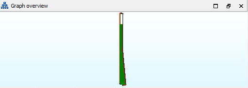

<div id="header" align="center">
  
  <div id="badges">
   <a href="https://discord.gg/tbQxq5uGAf">
     
   </a>
 </div>
</div>


# Compact SQLite Cipher Tool

## Overview

A Java-based tool for decrypting and encrypting `compact.sqlite` files used in certain game versions.

The `compact.sqlite` file is actually an encrypted ZIP archive containing binary database files.

## Features

Decryption support for 3 encryption types:

- `v2` - Game versions 2.x up to 3.0.0.3
- `v3` - Game versions starting from 3.1.x
- `v4` - AAFree & AAClassic game versions

Encryption support: Currently **only** `v2`.

AES key calculation - Derive AES keys bit when correct key/IV constants are provided.

RSA key formatting - Format and clean up RSA keys from `rsa_keys.txt` file.

## File Structure

The `compact.sqlite` file is not a genuine SQLite database, but an encrypted ZIP archive containing:

* Localization binary database files
* Data binary database files

## Future Development

* v3 encryption support
* v4 encryption support

## Setup

All files must be in the program folder.

1. DB file: `compact.sqlite`;
2. JSON config like: `config_2017_trion.json`;
3. RSA keys parts: `rsa_keys.txt` (optional).

## Config file structure v2

```json
{
  "provider": "Trion",
  "version": "2.0.1.7",
  "aes_first_stage": {
    "key_constant": "HEX",
    "iv_constant": "HEX",
    "key_bit": 128
  },
  "aes_second_stage": {
    "key_constant": "HEX",
    "iv_constant": "HEX",
    "key_bit": 256
  },
  "cipher_mode": "DECRYPT"
}
```

where:

- `provider` - localization provider
- `version` - game version
- `aes_first_stage.key_constant` - 8 length HEX
- `aes_first_stage.iv_constant` - 8 length HEX
- `aes_first_stage.key_bit` - AES key bit (128, 192, 256)
- `cipher_mode` - cipher mode

### Cipher mode

- `DECRYPT` - uses for decryption
- `ENCRYPT` - uses for encryption

## Config file structure v3

```json
{
  "provider": "Kakao",
  "version": "10.8.1.0",
  "pirate": false,
  "aes_first_stage": {
    "key_constant": "HEX",
    "iv_constant": "HEX",
    "key_bit": 256
  },
  "rsa": {
    "d": "HEX",
    "n": "HEX",
    "offset_constant": "HEX",
    "parts": 10,
    "c_length": "HEX",
    "m_length": "HEX"
  },
  "aes_second_stage": {
    "key_constant": "HEX",
    "iv_constant": "HEX",
    "key_bit": 192
  },
  "cipher_mode": "DECRYPT"
}
```

where:

- `pirate` - is AAFree or AAClassic client (required for AAFree & AAClassic versions, optionals for officials)
- `rsa.d` - private exponent in HEX (`"00"` if pirate)
- `rsa.n` - modulus in HEX (`"00"` if pirate)
- `rsa.offset_constant` - 8 length HEX
- `rsa.parts` - RSA parts
- `rsa.c_length` - 2 length HEX encrypted data length
- `rsa.m_length` - 2 length HEX decrypted data length (always less than `c_length`)

## RSA keys file structure

```text
23FFh
0BE3Eh
1291h
-
36B7h
28DCh
9AEEh
```

## GUI

### Cipher


### Calculate AES keys bit


### Format RSA keys


### Create DB schema

1. Open `x2game.dll` in IDA
2. Search string: `game_%u.sqlite3`
3. Jump to xref to operand... (`X` press) 
4. Copy current function name (like `sub_39935810`)
5. Open script `ida/dump_func.py`
6. Change `function_name` text in `170` line
7. Save it to any game folder (for convenience)
8. IDA -> File -> Script file -> Select `dump_func.py`
9. Wait for the execution and creation of the `db_function_tree.txt` file where `x2game.dll` present
10. Place `db_function_tree.txt` in the program folder

# Required

- [Java 21+](https://www.oracle.com/java/technologies/javase/jdk21-archive-downloads.html)

# Disclaimer

This tool is intended for educational purposes.

Users are responsible for complying with applicable laws and terms of service. The developers are not responsible for
any misuse of this software.